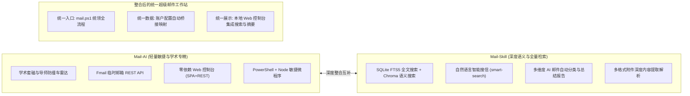

# Mail-AI 与 Mail-Skill 深度整合与架构整理方案

## 一、 整合背景与价值互补

`E:\Tools\mail-ai` 仓库与 `mail-skill`（源自 `lgwanai/mail-skill`）具有高度互补的技术优势与业务特长：



### 核心价值：
1. **检索能力飞跃**：原有 `mail-ai` 基于 IMAP 实时拉取过滤；`mail-skill` 提供本地 SQLite FTS5 与向量数据库，实现毫秒级全文与自然语言语义检索。
2. **AI 自动化升维**：补充自动邮件重要度分级（critical/high/normal/low）、日程提取、批量摘要周报、复杂附件深度解析（PDF/Excel/PPT/图片）。
3. **架构生态统一**：保留 `mail-ai` 的轻量 Web 仪表盘和学术防撞车特色，将 `mail-skill` 深度集成为其"数据与分析大脑"。

---

## 二、 整合后的目录结构

```
mail-ai\                             # 项目根目录
├── mail.ps1                          # 顶层统一网关
├── ui.ps1                            # Web 控制台启动器
├── setup-local.ps1                   # 本地环境初始化
├── .gitignore
├── README.md
├── INTEGRATION_PLAN.md               # 本文档
├── project_memory.md
│
├── fmail\                            # Cloudflare 临时邮箱
│
├── mail-ai\                          # 核心邮件引擎 + AI 检索
│   ├── core\                         # 共享底层引擎
│   │   ├── mail-engine.ps1           # 核心调度（含智能搜索 GB2312 解码）
│   │   ├── system-doctor.ps1         # 全局体检（含 mail-skill 依赖检测）
│   │   ├── draft-manager.ps1         # 草稿箱管理
│   │   ├── mailbox-inspector.ps1     # 邮箱巡检
│   │   ├── imap.bundle.js / smtp.bundle.js
│   │   └── setup-credential.ps1
│   ├── profiles\                     # 账户隔离 (edu / qq / netease)
│   ├── references\                   # 差异手册
│   ├── mail-skill\                   # AI 智能检索引擎
│   │   ├── scripts\mail_cli.py       # CLI 入口
│   │   ├── scripts\mail_manager\     # 核心模块 (config_manager 自动桥接)
│   │   └── mail_data\               # 运行时数据 (gitignore)
│   └── web\                          # Web 控制台 (前后端分离)
│       ├── server.py
│       └── index.html
│
└── taoci\                            # 推免套磁信系统
    ├── core\engine\                  # 批量发送/追踪/草稿/导师查重
    ├── personal\                     # 个人数据 (gitignore)
    └── scripts\
```

### 关键路径变更说明

| 旧路径 | 新路径 | 说明 |
|--------|--------|------|
| `mail-service/` | `mail-ai/` | 核心引擎目录重命名 |
| `套磁信/` | `taoci/` | 套磁信目录英文化 |
| `mail-skill/` (根级) | `mail-ai/mail-skill/` | 作为子引擎嵌入 |
| `web/` (根级) | `mail-ai/web/` | Web 控制台归入引擎 |
| `mail-service/profiles/` | `mail-ai/profiles/` | Profile 路径 |

---

## 三、 整合整理五大核心设计

### 1. 统一网关与 CLI 路由整合 (`mail.ps1`)
在根入口 [`mail.ps1`](./mail.ps1) 中新增子命令路由，实现单一命令行调用全套能力：

```powershell
# === 现有学术套磁与控制台命令 ===
.\mail.ps1 doctor                       # 系统全方位健康诊断（含 mail-skill 检测）
.\mail.ps1 ui                           # 启动本地可视化控制台
.\mail.ps1 draft list|view|send         # 草稿箱全生命周期管理
.\mail.ps1 check-mentor <姓名> [单位]   # 导师风控防撞车雷达
.\mail.ps1 attach list|verify           # 推免学术材料库自检
.\mail.ps1 fmail ...                    # Cloudflare 临时邮箱调度

# === 整合新增 mail-skill 智能检索与分析命令 ===
.\mail.ps1 sync [--via edu] [--days 7]              # 增量收取并建本地索引
.\mail.ps1 smart-search "<自然语言>"                  # 语义检索
.\mail.ps1 summarize [--limit 10]                    # 生成邮件分类摘要报告
.\mail.ps1 classify <message_id>                     # 单封邮件智能分类
.\mail.ps1 thread <message_id>                       # 邮件往来会话线索树
.\mail.ps1 skill <cmd> [args...]                     # 透传调用底层命令
```

---

### 2. 账户凭证零配置自动桥接 (Zero-Config Bridge)
- **痛点**：
  - `mail-ai` 账户在 `mail-ai/profiles/{edu,qq,netease}/`（`profile.json` 与 `.env`）。
  - `mail-skill` 账户在 `mail-skill/config.txt`。
- **解决方案**：
  - `config_manager.py` 自动发现并桥接 `mail-ai/profiles/` 下已配置的凭据（向上查找父级目录的 `profiles/`）。
  - 支持通过 `--account edu`、`--account qq`、`--account netease` 简写别名。
  - 用户**只需配置一次**，双引擎自动就绪，避免双重输入。

---

### 3. 本地 Web 控制台与 REST 接口聚合 (`mail-ai/web/`)
将 `mail-skill` 的高阶能力接入本地 Web SPA 控制台：
- **后端扩展 ([`mail-ai/web/server.py`](./mail-ai/web/server.py))**：
  - `GET /api/search?q=xxx&mode=smart`：调用后台搜索并返回标准 JSON。
  - `GET /api/summary?days=7`：返回近期发件人邮件聚合摘要。
  - `GET /api/classify?id=xxx`：返回邮件重要程度与分类标签。
- **前端扩展 ([`mail-ai/web/index.html`](./mail-ai/web/index.html))**：
  - 新增 **"智能邮件搜索引擎"** 卡片（支持自然语言搜索并高亮命中段落）。
  - 新增 **"邮件摘要与分类雷达"** 卡片（展示近期重要邮件排行榜与类别分布）。

---

### 4. 依赖分层与优雅降级机制 (Graceful Degradation)
- **分层设计**：
  - **基础运行层 (Layer 0 - 零 pip 依赖)**：未安装任何外部库时，原有发信、草稿、Web 控制台、导师风控 100% 正常运行。
  - **标准检索层 (Layer 1)**：安装 `imap-tools`、`beautifulsoup4`，启用全量收取与 SQLite FTS5 本地全文索引。
  - **高阶语义层 (Layer 2)**：可选安装 `chromadb`、`sentence-transformers`，启用向量语义搜信。
- **System Doctor 诊断升级**：
  - `system-doctor.ps1` 自动检测 `mail-skill` 的 Python 依赖和账户关联状态。
  - 输出评分包含 mail-skill 就绪度（当前体检：95分 极佳，3 个账户全部成功关联）。

---

### 5. Git 仓库代码结构整合方案

- **方案 A（统一嵌入式集成，推荐 ✅ 已实施）**：
  - 清除 `mail-skill` 目录内部独立的 `.git` 文件夹。
  - 将其作为 `mail-ai/mail-skill/` 标准子引擎整体纳入管理，统一脱敏与开源分发。用户一次 `git clone` 即可拥有全套工具。
  - `.gitignore` 已配置全量排除规则：`mail_data/`、`config.txt`、`__pycache__/`、`.env`、`contacts.json` 等运行时与敏感文件全部排除。

---

## 四、 已完成的整合工作

| 项目 | 状态 | 说明 |
|------|------|------|
| mail-skill 源码合入 | ✅ | 作为 `mail-ai/mail-skill/` 子目录纳入主仓 |
| 配置自动桥接 | ✅ | `config_manager.py` 自动发现 `profiles/` 下 3 个账户 |
| 顶层网关打通 | ✅ | `mail.ps1` 新增 sync/smart-search/summarize/classify/thread/skill |
| system-doctor 联动 | ✅ | 体检脚本检测 mail-skill 的 Python 依赖和账户数 |
| 路径修复 | ✅ | `_get_project_root()` 正确指向 `mail-ai/mail-skill/` |
| Windows UTF-8 适配 | ✅ | `mail_cli.py` 顶部已加 `sys.stdout.reconfigure` |
| 智能搜索 (GB2312) | ✅ | `mail-engine.ps1` 新增 MIME 解码 + fallback 本地搜索 |
| 目录重构 | ✅ | `mail-service→mail-ai`、`套磁信→taoci`、`mail-skill→mail-ai/mail-skill` |
| 全部路径引用更新 | ✅ | 15 个文件约 40 处路径引用全部更新 |
| 语法验证 | ✅ | 6 个 PS1 + 3 个 PY 全部通过 |
