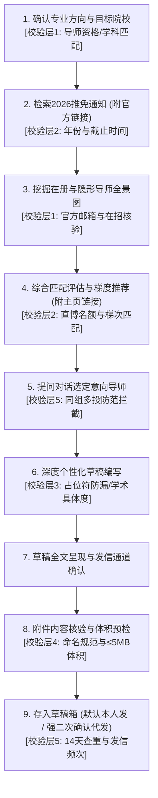

# 推免套磁信全流程智能技能规范 (9-Step SOP & 5-Layer Validation v3.1)

本技能专门服务于高校及科研院所导师的**推免/保研套磁**全流程。  
整个流程严格遵循**“提问式引导、官方通知权威溯源、隐形导师深度挖掘、五重质量风控校验、默认存入草稿箱”**的标准作业流程 (SOP)。

---

## ⛔ 核心安全红线与行为守则（最高优先级）

1. **绝对禁止删除任何邮件**：遵守整个 `mail-ai` 工具集的最高禁令，任何时候严禁触发删除操作。
2. **提问式单步推进原则（严禁跳步与信息轰炸）**：
   - 必须通过**提问式**一步步进行，禁止一次性把所有步骤推演完；
   - 必须在获得用户明确反馈与选择后，方可推进至下一步。
3. **带真实链接原则（严禁凭空捏造）**：
   - 检索 2026 当季推免/夏令营/九推通知时，**必须提供官方权威网址链接**；
   - 推荐导师时，**必须附带每位导师的个人官方主页或课题组主页链接**。
4. **默认存入草稿箱，绝不擅自直接发送（强二次确认原则）**：
   - 邮件编辑完毕后，**默认仅调用草稿接口存入草稿箱（`create-draft.ps1`）**；
   - 最终发送权利**默认完全保留给用户本人**（由用户登录官方网页端或客户端核验后自行点击发送）；
   - **代发唯一例外（必须满足双重关卡）**：
     - ① 用户必须在**单独的一次独立对话**中明确提出由 AI 代发；
     - ② AI 必须主动向用户进行**发信要素二次确认**（明确列出：收件人、主题、通道、附件清单）；
     - ③ 用户再次明确回复“确认发送”后，方可调用真实发信接口。否则一律严禁发送！
5. **双层隐私隔离守则**：
   - 通用底座 `core/` 严禁混入个人隐私，便于对外分享；
   - 个人画像、真实通讯录、投递日志与 PDF 附件严格存放于 `personal/` 目录，受 `.gitignore` 保护。

---

## 🛡️ 推免套磁五重质量与风控校验标准 (Five-Layer Validation)

在 9 步流程推进过程中，Agent 必须在关键节点严格执行以下五层校验标准：

### 校验层 1：导师资格与官方工作邮箱真实性校验
- **在岗在招状态**：确认导师未退休、未调离，本年度具备招收硕士或直博生的招生资格（兼职导师/挂名导师需特别核实）；
- **官方邮箱域名**：优先采用学校或研究所官方工作邮箱（如 `.edu.cn`、`.ac.cn`），遇到私人邮箱（如 163、QQ、gmail）时需向用户提示来源与真实性；
- **称谓与职称准确**：教授、研究员、副教授、副研究员需准确对应，严禁把副研错称为助理教授，严防“张老师老师”语病。

### 校验层 2：推免通知时效与截止期时限校验
- **年份核验**：必须为 **2026 当年最新发布**的通知（针对 2027 级免试研究生，即 2026 年夏令营/预报名/九推），严防过往年份旧政策误导；
- **截止时间比对**：实时比对当前日期与报名系统截止时间，已逾期的项目必须明确预警拦截，避免无用功；
- **培养类型匹配**：核验该学院/课题组是否招收直博生（针对用户个人攻读意向），若仅招专硕向用户如实反馈。

### 校验层 3：草稿学术质量与占位符防漏校验（一票否决）
- **占位符残留一票否决**：正文必须完全展开，严禁遗留任何未替换的 `{{...}}` 变量（系统内置代码级正则防火墙，发现残留直接终止保存）；
- **学术具体度校验（杜绝空话）**：正文中必须包含该导师近 1-2 年发表的具体代表作关键词、研究模型或关注核心问题，严禁通篇只有“对您的研究很感兴趣”等空洞泛话；
- **篇幅与结构把控**：中文 300~500 字，英文 200~350 词，确保手机端 60 秒内可高效读完。

### 校验层 4：附件规范性与体积安全校验
- **命名专业度**：严禁提交 `新建文档.pdf`、`未命名.pdf`、`简历(1).pdf`，必须规范命名为 `姓名-材料名.pdf`（如 `张三-简历.pdf`、`张三-个人陈述.pdf`）；
- **文件存在与可读**：文件必须存在于本地且体积 > 0 KB；
- **体积安全限制**：单文件建议 ≤2MB，附件总大小绝对不得超过 5MB（>10MB 触发系统强行拦截），防止被高校邮件服务器反垃圾防火墙静默丢弃。

### 校验层 5：投递安全、同组多投防范与发信频次风控
- **同组多投大忌拦截**：同一实验室、课题组或紧密合作团队内部，在未获上一位老师明确拒绝前，**绝对严禁同时联系两位老师**（学术界大忌，极易被通气取消资格）；
- **14 天防手滑查重**：扫描 `tracking.csv`，14 天内已成功发送过的老师自动拦截跳过；
- **发信频次与安全延时**：批量发送时默认单日 ≤5 封，且强制随机延时 30-60 秒，保护学术邮箱信誉。

---

## 📋 推免套磁 9 步标准作业流程 (SOP)

---

### 第 1 步：确定套磁目标院校与专业方向（结合【校验层1】）
- 调阅 `personal/profile.json`，主动向用户确认个人科研画像（姓名 / 毕业院校 / 专业 / 科研课题经历 / 硕士或直博意向）；
- 提问用户目标高校或科研院所，自动匹配该校对口的学院与学科。

### 第 2 步：查找 2026 最新推免通知（执行【校验层2】）
- 检索目标院校 2026 年（或当季九推/推免预选拔）最新官方通知；
- 核验简章时效性与系统填报截止时间；
- **必须提供官方权威网址链接**，格式如：`[学院名称2026年推免通知](https://...)`。

### 第 3 步：挖掘可选在册导师与“隐形导师”全景图（执行【校验层1】）
- 深入学院师资名单与重点实验室人员库；
- 特别深挖**隐形导师**（新引进青年PI、特聘研究员、副研究员、新回国建组有指标老师）；
- 核验官方工作邮箱有效性与职称。

### 第 4 步：综合匹配评估与梯度推荐（执行【校验层1与2】）
- 交叉评估课题契合度、课题组学术产出（近3年顶刊文章）与直博名额梯次；
- 给出分层推荐（冲刺型、主力匹配型、潜力新星型）；
- **每位推荐导师必须附带个人官方主页或课题组主页链接**，格式如：`[导师姓名 - 职称](官方主页URL)`。

#### 第 4 步附件：导师多维评估标准（v3.3 实战沉淀）
> 用户明确要求：选导师不能只看方向匹配度，必须综合导师学术水平与成果归属核查，且每校至少 3 位候选。

- **候选数量**：每所目标院校至少产出 **3 位候选导师**（首选+次选+备选），形成梯度，杜绝只推 1 人；
- **评估维度（至少 4 个，缺一不可）**：
  1. **方向匹配度**——与本科科研方向的对口程度（具体到机制/技术）；
  2. **学生兴趣方向**——是否是该生真正想做的方向，而非仅为上岸；
  3. **导师学术水平（分阶段核查）**：
     - 博士后期间发表期刊水平（早期能力起点）；
     - 独立 PI 后研究水平（建组以来代表作层次与连续性）；
     - 旗下学生博士毕业发表的论文水平（培养质量与师门传承，含学生去向）；
  4. **成果归属核查（关键防坑）**：
     - 确认代表作的**一作与通讯作者归属**是否确为该导师本人通讯、其指导的学生一作；
     - 警惕把"大牛组内其他 PI 的学生成果"误算到目标导师头上；
     - 优先采用该导师作为**通讯作者、学生一作**的成果作为其独立指导能力证据。
- **输出要求**：每位候选必须附"博士后代表作 / 独立PI代表作 / 学生一作通讯成果"**三栏证据**（年份、期刊、作者角色）与出处，并给出每所 3 人梯度推荐理由。

### 第 5 步：对话交流选定导师（执行【校验层5】）
- 呈现推荐名单，通过对话了解用户偏好，共同敲定具体联系导师；
- **同组多投检查**：如果用户选择的老师处于同一课题组，主动提出预警，建议分阶段先后联系。

### 第 6 步：个性化草稿深度定制编写（执行【校验层3】）
- 调阅该导师近 1-2 年最新发表代表作与核心关键词；
- 结合本科阶段真实学术或科研经历，撰写有深度学术说服力的定制草稿；
- 杜绝空泛套话，控制篇幅在 300~500 字黄金区间。

#### 第 6 步附件：正文打磨要素清单（v3.2 实战沉淀，务必逐条执行）
> 来源：`docs/case-20260905-刘光慧.md` 完整案例复盘。以下要素在本案例中经用户多轮迭代确认。

- **称呼**：直接"X研究员："或"X教授："，**不加"尊敬的"**（用户偏好去繁从简，除非用户另有要求）；
- **第一段**：姓名+学校+专业+推免资格+攻读意向（按用户锁定口径逐字体现，如"如有机会倾向于直博"），一句话表明"希望加入您的课题组，在 XX 方向继续学习"；不加"冒昧致信/恳请/深造"等客套；
- **科研经历段（核心定制段，必须基于简历+个人陈述真实内容）**：
  - 导师称谓准确：**教授/研究员**，严禁"张老师老师"类语病；
  - 若真实科研为独立完成，强调"**完全独立负责**"（独立科研能力是推免加分卖点）；
  - 科研全链路尽量完整：平台搭建→综述撰写→实验设计→实验操作→数据分析→论文撰写；
  - **实验流程顺序必须与简历原文一致**（本案例：先荟萃分析筛选→再建模→元素湿实验评价→机制探究，顺序颠倒即被用户纠正）；
  - **具体成果必须写实**：如元素各自的机制分工（硒→氧化应激、钒→线粒体功能、锌→DNA损伤）+ 协同组合（Se+Zn+Cr+V、Se+Zn+V+Li），严禁只写"筛选了 X 种元素"这种空泛概括；
  - 与导师方向契合句：引用导师研究范式关键词（如"人类衰老的遗传与表观遗传信息解码、多组学分析与人工智能"），契合度用**"较为契合"**，避免"高度契合"式自夸；
- **能力段**：泛化表述（"较强的 AI 应用与文献分析能力"），具体数字留给附件证明，不硬堆；
- **结尾**：简洁直接（如"不知您是否还有名额。"+"祝好"），用户普遍删掉"恳请拨冗审阅/盼能得到您的指导"等正式客套；
- **落款**：姓名/学校学院专业/邮箱（必须保留）；
- **笔误提醒**：用户提供全文时逐字采纳，但主动提醒疑似笔误（本案例"结果发现发现"→"结果发现"）后按用户确认修正；
- **主题**：可自定义为"推免研究生申请-姓名-学校"格式，比模板默认主题更专业。

### 第 7 步：确认草稿全文与发信通道
- 完整展示邮件卡片（收件人、主题、称谓、正文预览、落款）；
- 主动确认正文满意度，确认发信通道（首选 高校校园学术邮箱 (首选 --via edu)）。

### 第 8 步：核查与确认附件清单（执行【校验层4】）
- 确认挂载附件（`张三-简历.pdf`、`张三-个人陈述.pdf` 等）；
- 自动检查附件是否存在于 `personal/attachments/`，校验命名是否专业规范，确保体积 ≤5MB。

#### 第 8 步附件：附件源文件夹核查与回退策略（v3.2 实战沉淀）
> 案例：用户指定"预推免院校相关的生物物理所"文件夹，实际路径为 `院校-夏令营\中科院生物物理\`，且其中**只有一份旧版简历（10-个人简历.pdf）、没有个人陈述**。

- **用户指定的文件夹可能名不副实**（目录归属/名称与用户描述不符），务必实际列出该目录内容核实，不能将错就错；
- **文件夹可能缺件**（只有简历没有个人陈述），须如实告知用户并给方案；
- **回退策略**：改用个人材料根目录（如 `精粹\`）下的**最新通用版**（简历选最新版本，陈述选干净通用版）；
- **附件内容核验三查**：
  1. 版本新旧（旧版 GPA 口径/科研描述过时，如旧简历为 GPA 3.557/4.0）；
  2. 是否残留其他导师/学校名字（案例：于乐谦版个人陈述残留"尤其对高虹老师…"，仅存在 `套磁-导师\动物研究所于乐谦\个人陈述.pdf`，精粹版干净）；
  3. 可读性（用 pypdf 验证页数、首行文本正常、体积 >0）；

### 第 9 步：存入草稿箱 + 强二次确认代发安全关卡
- **默认执行**：调用 `.\create-draft.ps1` 将邮件存入对应邮箱草稿箱；
  - 脚本内置**代码级正则检测**，发现任何未替换占位符（如 `{{INTEREST}}`）立即强行终止；
  - 明确报告草稿已保存，**最终发送权保留给用户本人在客户端/网页端检查后手动发送**；
- **代发强二次确认**：
  - 用户在独立对话中提出代发 → AI 主动呈现要素二次确认单 → 用户回复“确认发送” → 调起发信接口。

---

## 🛠️ 工具速查

| 脚本命令 | 核心功能与内置校验 |
| :--- | :--- |
| **`.\create-draft.ps1`** | 生成单封个性化草稿。**内置邮箱格式、占位符残留一票否决、附件命名规范校验**。 |
| **`.\batch-send.ps1 --draft`** | 批量草稿生成模式。内置占位符残留检测与附件体积预检，全部安全存入草稿箱。 |
| **`.\batch-send.ps1`** | 真实批量发送模式。内置 14 天查重防手滑拦截与 30-60 秒随机安全时延。 |
| **`.\track-mail.ps1`** | 跨邮箱联合回信检索，一键导出 7 天未回复 Follow-up 清单。 |

## ⚡ 极速微程序速查 (Micro-tools)

为避免每次临时编写脚本或转义命令导致低效，已将下列高频限定操作固化为即用工具：

| 命令 | 说明与操作目标 |
| :--- | :--- |
| **.\mail.ps1 draft list [--via edu]** | 秒级列出草稿箱中所有草稿（序号、导师、主题、附件、时间）。 |
| **.\mail.ps1 draft view <ID> [--via edu]** | 查看指定草稿全文、挂载附件及排版。 |
| **.\mail.ps1 draft clean-test [--via edu]** | 一键将测试草稿安全归档至 rchived/（绝不物理删除）。 |
| **.\mail.ps1 draft send <ID> --via edu --confirm** | 一键外发指定草稿（必须含 --confirm 强二次确认）。 |
| **.\mail.ps1 attach list** | 检查当前私有附件库，查看绑定的默认简历。 |
| **.\mail.ps1 attach verify** | 执行第四层学术风控体检（命名规范、≤5MB 体积、PDF 完整性）。 |
| **.\mail.ps1 attach bind <ID/文件名>** | 一键将某份材料绑定为 profile.json 中的默认简历。 |
| **.\mail.ps1 scan [--via edu]** | 一键巡检收件箱、草稿箱、已发送、垃圾邮件与广告邮件。 |
| **.\mail.ps1 search-all <关键词> [--via edu]** | 跨全文件夹深度检索，防止推免初审通知漏入垃圾箱。 |
| **.\mail.ps1 check-mentor <导师姓名> [单位]** | 导师风控体检（14天查重、同课题组/单位撞车防范预警）。 |
| **.\mail.ps1 doctor** | 系统全局健康诊断（通道连通性、材料库规范、草稿箱、误拦截雷达）。 |

---

## 📚 实战复盘参照（v3.2 新增）

- **完整案例复盘**：`docs/case-20260905-刘光慧.md` —— 中科院动物研究所刘光慧套磁全流程（选导师→起草→多轮打磨→附件处理→草稿同步），含邮件最终版全文与全部修改要素。

### 草稿生成与同步工程要点（本案例踩坑沉淀）
1. **引擎脚本需 UTF-8 BOM**：`core\engine\create-draft.ps1`、`mentor-checker.ps1` 曾缺 BOM 导致 PowerShell 5.1 中文乱码解析失败 → 已用 Python 二进制补 `\xef\xbb\xbf` 前缀（永久修复）；
2. **模板自动生成的是简版**：需手工把草稿 JSON 的 Body 升级为定制版，JSON 校验 + 无占位符；
3. **附件挂载 WARN 是误报**：PS 层 `Resolve-AttachmentPath` 把逗号串整体 Test-Path 报"附件文件不存在"，但 node 层 `imap.bundle.js` 会 `split(',')` 正确挂载 → 云端草稿实际带附件，用 fetch 验证即可，不必回退；
4. **每次修改 = 重新同步一封新草稿**（不删除旧草稿）→ 草稿箱累积多封，认准最新（时间倒序第一条）；
5. **本地 JSON 是权威版本**，云端草稿箱是可编辑副本；正文升级后务必重新同步，避免"简版/精版"混乱；
6. **云端验证命令**：`mail-engine -Account edu search --mailbox 草稿箱 --limit 1` 拿最新 UID → `fetch <UID> --mailbox 草稿箱` 核对正文/主题/附件；
7. **默认不代发**：草稿只存草稿箱，发送权保留给用户本人。 |

---

## 🛡️ 开源前隐私检查清单（v3.2 新增 · 提交公共仓库前必须核对）

> 仓库已关联公共远程（如 GitHub `origin`）。**任何 `git add`/`commit`/`push` 前**，必须按下表核对，防止个人隐私（姓名、邮箱、电话、学校、课题、简历、通讯录、投递记录）泄露到公共仓库。

### ⛔ 绝不上传（已由 .gitignore 保护，勿用 `-f` 强制添加）
- `personal/` 全部：`profile.json`（真实学生画像）、`contacts.csv`（真实通讯录）、`tracking.csv`（投递日志）、`attachments/*.pdf`（简历/陈述/申请材料）、`references/`（个人科研复盘）
- 真实账号配置：`mail-ai/profiles/**/profile.json`、`signature.html`
- 草稿：`drafts/`、`**/drafts/`
- 含学生信息的交付文档：`*套磁信-最终版.md`、`*调研报告.html`、`docs/`（原始案例复盘）、`*.pdf / *.docx / *.pptx`
- 运行产物：`.preview/`、`downloads/`、`*.log`
- 含本地绝对路径的脚本（如 `E:\Uself_document\个人信息\...`，暴露磁盘结构）

### ✅ 可提交开源（通用底座）
- `mail-ai/core/*`（引擎脚本、bundle）、`references/`
- `profiles/**/profile.sample.json`、`signature.sample.html`（仅示例）
- `taoci/SKILL.md`、`core/engine/*`、`core/schemas/*.sample.*`、`core/templates/*`
- 入口脚本（`mail.ps1`、`*.ps1` 入口）

### 🔍 提交前三步核对（强制）
1. `git status` —— 查看全部 untracked 文件，逐一判断是否含个人信息；
2. `git check-ignore -v <file>` —— 确认敏感文件已被忽略；
3. 命名遵循 `.gitignore` 规则（`personal/`、`docs/`、`*最终版*.md`、`*.pdf` 等）。

### 🧪 新产生个人材料的处置规则
- 含学生真实信息的文档 → 一律放入 `personal/` 或 `docs/`（已忽略）；
- 想开源的知识沉淀 → **先脱敏**（姓名→XX同学、邮箱/电话→占位、学校→XX大学、具体个人数据→示例），脱敏后再放入可提交目录；
- **严禁** `git add .` 后不检查直接提交推送。

### 📌 历史核验（本次已执行）
- mail-ai 主仓库 + 套磁信子仓库的 `git log --all --name-only` 已核查：历史中仅出现通用底座与 sample，**无个人数据**；未来每次开源前建议复查一次历史。
