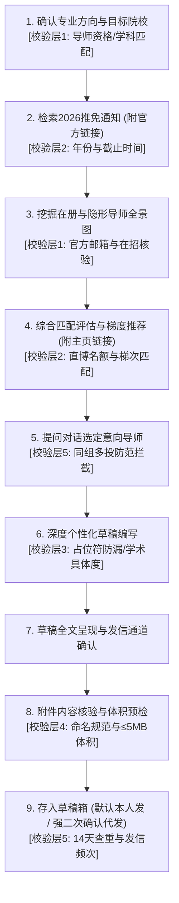

# 推免套磁信全流程智能技能规范 (9-Step SOP & 5-Layer Validation v3.1)

本技能专门服务于高校及科研院所导师的**推免/保研套磁**全流程。  
整个流程严格遵循**“提问式引导、官方通知权威溯源、隐形导师深度挖掘、五重质量风控校验、默认存入草稿箱”**的标准作业流程 (SOP)。

---

## ⛔ 核心安全红线与行为守则（最高优先级）

1. **绝对禁止删除任何邮件**：遵守整个 `mail-ai` 工具集的最高禁令，任何时候严禁触发删除操作。
2. **提问式单步推进原则（严禁跳步与信息轰炸）**：
   - 必须通过**提问式**一步步进行，禁止一次性把所有步骤推演完；
   - 必须在获得用户明确反馈与选择后，方可推进至下一步。
3. **带真实链接原则（严禁凭空捏造）**：
   - 检索 2026 当季推免/夏令营/九推通知时，**必须提供官方权威网址链接**；
   - 推荐导师时，**必须附带每位导师的个人官方主页或课题组主页链接**。
4. **默认存入草稿箱，绝不擅自直接发送（强二次确认原则）**：
   - 邮件编辑完毕后，**默认仅调用草稿接口存入草稿箱（`create-draft.ps1`）**；
   - 最终发送权利**默认完全保留给用户本人**（由用户登录官方网页端或客户端核验后自行点击发送）；
   - **代发唯一例外（必须满足双重关卡）**：
     - ① 用户必须在**单独的一次独立对话**中明确提出由 AI 代发；
     - ② AI 必须主动向用户进行**发信要素二次确认**（明确列出：收件人、主题、通道、附件清单）；
     - ③ 用户再次明确回复“确认发送”后，方可调用真实发信接口。否则一律严禁发送！
5. **双层隐私隔离守则**：
   - 通用底座 `core/` 严禁混入个人隐私，便于对外分享；
   - 个人画像、真实通讯录、投递日志与 PDF 附件严格存放于 `personal/` 目录，受 `.gitignore` 保护。

---

## 🛡️ 推免套磁五重质量与风控校验标准 (Five-Layer Validation)

在 9 步流程推进过程中，Agent 必须在关键节点严格执行以下五层校验标准：

### 校验层 1：导师资格与官方工作邮箱真实性校验
- **在岗在招状态**：确认导师未退休、未调离，本年度具备招收硕士或直博生的招生资格（兼职导师/挂名导师需特别核实）；
- **官方邮箱域名**：优先采用学校或研究所官方工作邮箱（如 `.edu.cn`、`.ac.cn`），遇到私人邮箱（如 163、QQ、gmail）时需向用户提示来源与真实性；
- **称谓与职称准确**：教授、研究员、副教授、副研究员需准确对应，严禁把副研错称为助理教授，严防“张老师老师”语病。

### 校验层 2：推免通知时效与截止期时限校验
- **年份核验**：必须为 **2026 当年最新发布**的通知（针对 2027 级免试研究生，即 2026 年夏令营/预报名/九推），严防过往年份旧政策误导；
- **截止时间比对**：实时比对当前日期与报名系统截止时间，已逾期的项目必须明确预警拦截，避免无用功；
- **培养类型匹配**：核验该学院/课题组是否招收直博生（针对用户个人攻读意向），若仅招专硕向用户如实反馈。

### 校验层 3：草稿学术质量与占位符防漏校验（一票否决）
- **占位符残留一票否决**：正文必须完全展开，严禁遗留任何未替换的 `{{...}}` 变量（系统内置代码级正则防火墙，发现残留直接终止保存）；
- **学术具体度校验（杜绝空话）**：正文中必须包含该导师近 1-2 年发表的具体代表作关键词、研究模型或关注核心问题，严禁通篇只有“对您的研究很感兴趣”等空洞泛话；
- **篇幅与结构把控**：中文 300~500 字，英文 200~350 词，确保手机端 60 秒内可高效读完。

### 校验层 4：附件规范性与体积安全校验
- **命名专业度**：严禁提交 `新建文档.pdf`、`未命名.pdf`、`简历(1).pdf`，必须规范命名为 `姓名-材料名.pdf`（如 `张三-简历.pdf`、`张三-个人陈述.pdf`）；
- **文件存在与可读**：文件必须存在于本地且体积 > 0 KB；
- **体积安全限制**：单文件建议 ≤2MB，附件总大小绝对不得超过 5MB（>10MB 触发系统强行拦截），防止被高校邮件服务器反垃圾防火墙静默丢弃。

### 校验层 5：投递安全、同组多投防范与发信频次风控
- **同组多投大忌拦截**：同一实验室、课题组或紧密合作团队内部，在未获上一位老师明确拒绝前，**绝对严禁同时联系两位老师**（学术界大忌，极易被通气取消资格）；
- **14 天防手滑查重**：扫描 `tracking.csv`，14 天内已成功发送过的老师自动拦截跳过；
- **发信频次与安全延时**：批量发送时默认单日 ≤5 封，且强制随机延时 30-60 秒，保护学术邮箱信誉。

---

## 📋 推免套磁 9 步标准作业流程 (SOP)

---

### 第 1 步：确定套磁目标院校与专业方向（结合【校验层1】）
- 调阅 `personal/profile.json`，主动向用户确认个人科研画像（姓名 / 毕业院校 / 专业 / 科研课题经历 / 硕士或直博意向）；
- 提问用户目标高校或科研院所，自动匹配该校对口的学院与学科。

### 第 2 步：查找 2026 最新推免通知（执行【校验层2】）
- 检索目标院校 2026 年（或当季九推/推免预选拔）最新官方通知；
- 核验简章时效性与系统填报截止时间；
- **必须提供官方权威网址链接**，格式如：`[学院名称2026年推免通知](https://...)`。

### 第 3 步：挖掘可选在册导师与“隐形导师”全景图（执行【校验层1】）
- 深入学院师资名单与重点实验室人员库；
- 特别深挖**隐形导师**（新引进青年PI、特聘研究员、副研究员、新回国建组有指标老师）；
- 核验官方工作邮箱有效性与职称。

### 第 4 步：综合匹配评估与梯度推荐（执行【校验层1与2】）
- 交叉评估课题契合度、课题组学术产出（近3年顶刊文章）与直博名额梯次；
- 给出分层推荐（冲刺型、主力匹配型、潜力新星型）；
- **每位推荐导师必须附带个人官方主页或课题组主页链接**，格式如：`[导师姓名 - 职称](官方主页URL)`。

### 第 5 步：对话交流选定导师（执行【校验层5】）
- 呈现推荐名单，通过对话了解用户偏好，共同敲定具体联系导师；
- **同组多投检查**：如果用户选择的老师处于同一课题组，主动提出预警，建议分阶段先后联系。

### 第 6 步：个性化草稿深度定制编写（执行【校验层3】）
- 调阅该导师近 1-2 年最新发表代表作与核心关键词；
- 结合本科阶段真实学术或科研经历，撰写有深度学术说服力的定制草稿；
- 杜绝空泛套话，控制篇幅在 300~500 字黄金区间。

### 第 7 步：确认草稿全文与发信通道
- 完整展示邮件卡片（收件人、主题、称谓、正文预览、落款）；
- 主动确认正文满意度，确认发信通道（首选 高校校园学术邮箱 (首选 --via edu)）。

### 第 8 步：核查与确认附件清单（执行【校验层4】）
- 确认挂载附件（`张三-简历.pdf`、`张三-个人陈述.pdf` 等）；
- 自动检查附件是否存在于 `personal/attachments/`，校验命名是否专业规范，确保体积 ≤5MB。

### 第 9 步：存入草稿箱 + 强二次确认代发安全关卡
- **默认执行**：调用 `.\create-draft.ps1` 将邮件存入对应邮箱草稿箱；
  - 脚本内置**代码级正则检测**，发现任何未替换占位符（如 `{{INTEREST}}`）立即强行终止；
  - 明确报告草稿已保存，**最终发送权保留给用户本人在客户端/网页端检查后手动发送**；
- **代发强二次确认**：
  - 用户在独立对话中提出代发 → AI 主动呈现要素二次确认单 → 用户回复“确认发送” → 调起发信接口。

---

## 🛠️ 工具速查

| 脚本命令 | 核心功能与内置校验 |
| :--- | :--- |
| **`.\create-draft.ps1`** | 生成单封个性化草稿。**内置邮箱格式、占位符残留一票否决、附件命名规范校验**。 |
| **`.\batch-send.ps1 --draft`** | 批量草稿生成模式。内置占位符残留检测与附件体积预检，全部安全存入草稿箱。 |
| **`.\batch-send.ps1`** | 真实批量发送模式。内置 14 天查重防手滑拦截与 30-60 秒随机安全时延。 |
| **`.\track-mail.ps1`** | 跨邮箱联合回信检索，一键导出 7 天未回复 Follow-up 清单。 |

## ⚡ 极速微程序速查 (Micro-tools)

为避免每次临时编写脚本或转义命令导致低效，已将下列高频限定操作固化为即用工具：

| 命令 | 说明与操作目标 |
| :--- | :--- |
| **.\mail.ps1 draft list [--via edu]** | 秒级列出草稿箱中所有草稿（序号、导师、主题、附件、时间）。 |
| **.\mail.ps1 draft view <ID> [--via edu]** | 查看指定草稿全文、挂载附件及排版。 |
| **.\mail.ps1 draft clean-test [--via edu]** | 一键将测试草稿安全归档至 rchived/（绝不物理删除）。 |
| **.\mail.ps1 draft send <ID> --via edu --confirm** | 一键外发指定草稿（必须含 --confirm 强二次确认）。 |
| **.\mail.ps1 attach list** | 检查当前私有附件库，查看绑定的默认简历。 |
| **.\mail.ps1 attach verify** | 执行第四层学术风控体检（命名规范、≤5MB 体积、PDF 完整性）。 |
| **.\mail.ps1 attach bind <ID/文件名>** | 一键将某份材料绑定为 profile.json 中的默认简历。 |
| **.\mail.ps1 scan [--via edu]** | 一键巡检收件箱、草稿箱、已发送、垃圾邮件与广告邮件。 |
| **.\mail.ps1 search-all <关键词> [--via edu]** | 跨全文件夹深度检索，防止推免初审通知漏入垃圾箱。 |
| **.\mail.ps1 check-mentor <导师姓名> [单位]** | 导师风控体检（14天查重、同课题组/单位撞车防范预警）。 |
| **.\mail.ps1 doctor** | 系统全局健康诊断（通道连通性、材料库规范、草稿箱、误拦截雷达）。 |
